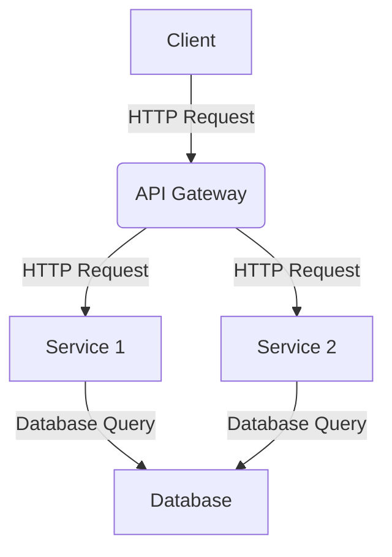

# 🤖 DEV ChatGPT Prompts

Welcome to my personal collection of ChatGPT prompts for developers! 🙌

This repository contains a list of powerful ChatGPT prompts that can help you get the creative juices flowing. 💡 Whether you are a beginner or an experienced pro, these prompts can help you think outside the box and find new solutions to problems. 🚀

The list is divided into categories: [ prompts for coders, students, marketers, and content writers ]. So no matter your profession, there is something here for everyone! 😊 Let’s dive right into these powerful ChatGPT prompts that can help take your creativity to the next level! 🌊

## Table of Contents

Prompts for Coders

- [🚩 Tips](#-tips)
- [🔗 A Multi-Prompt Approach (Prompt Chaining)](#-a-multi-prompt-approach-prompt-chaining)
  - [1. Modernize and add best practices](#1-modernize-and-add-best-practices)
  - [2. Review your code for logical errors and security concerns](#2-review-your-code-for-logical-errors-and-security-concerns)
  - [3. Validate the recommendations (reflexion)](#3-validate-the-recommendations-reflexion)
  - [4. Write the Code](#4-write-the-code)
  - [5. Create Tests](#5-create-tests)
- [Re-write Prompt](#re-write-prompt)
- [ChatGPT prompt optimizer](#chatgpt-prompt-optimizer)
- [Ask for alternatives](#ask-for-alternatives)
- [Documentation / Explaination](#documentation--explaination)
  - [Adding Documentation](#adding-documentation)
  - [Write your terms and conditions](#write-your-terms-and-conditions)
  - [Produce cheat sheets](#produce-cheat-sheets)
  - [Generate Readme Files](#generate-readme-files)
  - [Write detailed blogs](#write-detailed-blogs)
  - [Explain Code](#explain-code)
  - [Architecture Diagram (Mermaid)](#architecture-diagram-mermaid)
  - [Entity Relationship Diagram (Mermaid)](#entity-relationship-diagram-mermaid)
- [Code Refactoring](#code-refactoring)
  - [Refactor Code](#refactor-code)
  - [Modernizing Old Code](#modernizing-old-code)
  - [Code in to Multiple Methods](#code-in-to-multiple-methods)
  - [Better Performance](#better-performance)
  - [Adding a Parameter to a Function](#adding-a-parameter-to-a-function)
  - [Adding Coding Best Practices or Principles](#adding-coding-best-practices-or-principles)
  - [Follow coding style guidelines](#follow-coding-style-guidelines)
  - [Detecting and Fixing Errors](#detecting-and-fixing-errors)
  - [Debug a React component](#debug-a-react-component)
  - [Create Unit Tests](#create-unit-tests)
  - [Transpiling Code](#transpiling-code)
  - [Responsive Design](#responsive-design)
  - [Internationalization](#internationalization)
  - [Add comments to code](#add-comments-to-code)
- [Code Generation](#code-generation)
  - [Create Functions](#create-functions)
  - [Generate a Dockerfile](#generate-a-dockerfile)
  - [Write a RegEx](#write-a-regex)
  - [Create a Class](#create-a-class)
  - [Add Functionality](#add-functionality)
  - [Create Boilerplate Code](#create-boilerplate-code)
  - [You are a world class software engineer](#you-are-a-world-class-software-engineer)
- [Code Review](#code-review)
  - [Error Hendling](#error-hendling)
  - [Suggest Improvements](#suggest-improvements)
- [Product Service Promotion](#product-service-promotion)
  - [Generate innovative product ideas](#generate-innovative-product-ideas)
  - [Develop a unique value proposition](#develop-a-unique-value-proposition)
  - [Master the art of storytelling for marketing](#master-the-art-of-storytelling-for-marketing)
  - [Create a successful referral program](#create-a-successful-referral-program)
  - [Master the art of upselling and cross-selling](#master-the-art-of-upselling-and-cross-selling)
  - [Create a viral marketing campaign](#create-a-viral-marketing-campaign)
  - [Develop a powerful elevator pitch](#develop-a-powerful-elevator-pitch)
  - [Create an actionable marketing plan](#create-an-actionable-marketing-plan)
  - [Leverage content marketing for lead generation](#leverage-content-marketing-for-lead-generation)

## 🚩 Tips

Like many things in life, with GPT-4, you get out what you put in. In this case, providing more context, instructions, and guidance will usually produce better results.

Here are some tips and techniques to improve:

- **Split your prompts:**
Try breaking your prompts and desired outcome across multiple steps. Keeping prompts to have a single outcome has shown to produce better results than combined prompts. For example, ask for a review, then ask for a refactor based on the review response. This may become less important in time as LLMs increase their token limit.

- **Give Examples:**
Provide expected inputs, data and outputs to improve accuracy quality. 📝

- **Be Specific:**
Don’t be afraid to list exactly what you want, what you know, what is needed, and what not to include. 🔎

- **Ask it to Reflect:**
A technique called reflexion has been shown to increase GPT4’s accuracy. Basically ask it ‘Why were you wrong?’ or get it to reflect and review its own response. 🤔

## 🔗 A multi-prompt approach (prompt chaining)

can be used to update, refactor, and review a piece of code. A well-designed set of prompts is one where each has separated concerns and singular responsibilities.

### 1. Modernize and add best practices
---

by getting GPT-4 to re-write your code into the style you want. This step will generally result in coherent output, in the style you want, but may introduce errors, so we do it first.

**Prompt:**

```
Review the following code and re-write it to modern es6 programming standards and formatting:

[insert code here]
```

### 2. Review your code for logical errors and security concerns
---

Get recommendations to improve any logical or security concerns introduced. It’s important that we don’t ask for a refactor, just the reasoning behind wanting the refactor.

**Prompt:**

```
Review your provided code 'tempFunction' for any logical or security concerns and provide a list of recommendations.
```

### 3. Validate the recommendations (reflexion)
---

Validate the provided recommendations. Reflexion is a powerful technique to improve the accuracy of the initial recommendations and try to eliminate any hallucinations. This is not always required but it is worth asking if you are unsure about any recommendations.

**Prompt:**

```
Review your above recommendations. Tell me why you were wrong and if any recommendations were overlooked or incorrectly added?
```

### 4. Write the Code
---

Combine your reviews, recommendations and feedback to get GPT-4 to write your new function.

**Prompt:**

```
Re-write the 'tempFunction' function based off your review and recommendations.
```

### 5. Create Tests
---

Create some simple tests that we can run locally and validate the results

**Prompt:**

```
Create two [ define technology ] tests for the above 'tempFunction' function. One that is expected to pass and one that is expected to fail.
```

## Re-write Prompt

Let's see if we can get GPT4 to make or average prompts and turn them into "voyage inspirant" type mastery prompts.

**Prompt:**

```
[your prompt]

Re-write the above text to be more verbose and include a lot of superfluous description about each thing, use very painting language.
```

<sup>[⬆️ Back to table of contents](#table-of-contents)</sup>

## ChatGPT prompt optimizer

**Prompt:**

```
I'll provide a chatGPT prompt. You'll ask questions to understand the audience and goals, then optimize the prompt for effectiveness and relevance using the principle of specificity.
```

<sup>[⬆️ Back to table of contents](#table-of-contents)</sup>

## Ask for alternatives

If you're not satisfied with your solution you can ask to ChatGPT to give you alternatives

**Prompt:**

```
I'll provide you with a piece of code that I made and 
I need you give me alternatives to do the same in other way:

[INSERT YOUR CODE HERE]
```

<sup>[⬆️ Back to table of contents](#table-of-contents)</sup>

---

## Documentation / Explaination

### Adding Documentation
---

> [!NOTE]
> Adding documentation requires creating clear and comprehensive explanations of a module’s purpose, design, and implementation.

Prompt 1#:

```
I don't know how to code, but I want to understand how this works. Explain the following code to me in a way that a non-technical person can understand. Always use Markdown with nice formatting to make it easier to follow. Organize it by sections with headers. Include references to the code as markdown code blocks in each section. The code:

[insert code here]
```

Prompt 2#:

```
Please add comprehensive documentation for [file or module name], including clear and concise explanations of its purpose, design, and implementation. Consider including examples of how to use the module, as well as any relevant diagrams or flow charts to help illustrate its workings. Ensure that the documentation is easily accessible to other developers and is updated as the module evolves. Consider using documentation tools such as inline comments, markdown files, or a documentation generator to simplify the process.

[insert code here]
```

<sup>[⬆️ Back to table of contents](#table-of-contents)</sup>

### Write your terms and conditions
---

**Prompt:**

```
Create terms and services for my website about an [AI tool] called [name].
```

<sup>[⬆️ Back to table of contents](#table-of-contents)</sup>

### Produce cheat sheets
---

**Prompt:**

```
Write a cheat sheet for [markdown formatting].
```

<sup>[⬆️ Back to table of contents](#table-of-contents)</sup>

### Generate Readme Files
---

**Prompt:**

```
Generate documentation for the code below. You should include detailed instructions to allow a developer to run it on a local machine, explain what the code does, and list vulnerabilities that exist in this code.

[enter code]
```

<sup>[⬆️ Back to table of contents](#table-of-contents)</sup>

### Write detailed blogs
---

**Prompt:**

```
Write a detailed blog on How to build a [COVID tracker] using React with proper structuring of code.
```

<sup>[⬆️ Back to table of contents](#table-of-contents)</sup>

### Explain Code

---

> [!NOTE]
> Don't spend time trying to figure out how code works, just ask ChatGPT to explain it to you

**Prompt:**

```
Context: I'm starting a new position as backend developer and I have to start to understand how some functions are working
Technologies: [INSERT YOUR TECHNOLOGIES HERE]
You have to: explain me the code line by line

[INSERT YOUR CODE HERE]
```

<sup>[⬆️ Back to table of contents](#table-of-contents)</sup>

### Architecture Diagram (Mermaid)

---

> [!NOTE]
> Create a diagram of your architecture using Mermaid

**Prompt:**

```
Write the Mermaid code for an architecture diagram for this solution [DESCRIBE SOLUTION]
```

Example:



<sup>[⬆️ Back to table of contents](#table-of-contents)</sup>

### Entity Relationship Diagram (Mermaid)

---

> [!NOTE]
> Create an entity relationship diagram using Mermaid

**Prompt:**

```
Write the Mermaid code for an entity relationship diagram for these classes [INSERT CLASSES]
```

<sup>[⬆️ Back to table of contents](#table-of-contents)</sup>

## Code Refactoring

### Refactor Code

---

> [!NOTE]
> Ask to ChatGPT to refactor your code

**Prompt:**

```
I have a piece of code and I need you do a refactor of it:

[INSERT YOUR CODE HERE]
```

Refactoring code is an essential process in software development that aims to improve the quality, readability, and maintainability of existing code without altering its functionality. Refactoring can enhance code efficiency, reduce errors, and make it easier to modify or extend in the future. With ChatGPT’s help, you can effectively refactor your code and achieve a better code structure.

<sup>[⬆️ Back to table of contents](#table-of-contents)</sup>

### Modernizing Old Code

---

> [!NOTE]
> By providing your old function to GPT-4 and asking it to refactor it to modern coding practices, you can quickly modernize your code.

**Prompt:**

```
Refactor the following code to modern es6 programming standards:

[INSERT YOUR CODE HERE]
```

<sup>[⬆️ Back to table of contents](#table-of-contents)</sup>

### Code in to Multiple Methods

---

> [!NOTE]
>If you have a long function that is doing too much, you can ask GPT-4 to refactor it into multiple methods.

**Prompt:**

```
Refactor the following code into multiple methods to improve readability and maintainability:

[INSERT YOUR CODE HERE]
```

<sup>[⬆️ Back to table of contents](#table-of-contents)</sup>

### Better Performance

---

> [!NOTE]
> If you have a function that is taking too long to run, you can ask GPT-4 to refactor it to improve performance.

**Prompt:**

```
Refactor the following code to improve performance:

[INSERT YOUR CODE HERE]
```

<sup>[⬆️ Back to table of contents](#table-of-contents)</sup>

### Adding a Parameter to a Function

---

**Prompt:**

```
Add a parameter to this function to do [FUNCTIONALITY]

[INSERT YOUR CODE HERE]
```

<sup>[⬆️ Back to table of contents](#table-of-contents)</sup>

### Adding Coding Best Practices or Principles

---

> [!NOTE]
>Let ChatGPT rewrite the code for you according to style guidelines.

**Prompt:**

```
Rewrite the code below following the Google style guidelines for javascript.

[INSERT YOUR CODE HERE]
```

<sup>[⬆️ Back to table of contents](#table-of-contents)</sup>

### Follow coding style guidelines

---

> [!NOTE]
> If your organization or code base uses specific coding practices and styles that you want to maintain, you can provide instructions to GPT-4 on which particular coding practice or style you’d like it to focus on.

**Prompt:**

```
Review the following code and refactor it to make it more DRY and adopt the SOLID programming principles.

[INSERT YOUR CODE HERE]
```

<sup>[⬆️ Back to table of contents](#table-of-contents)</sup>

### Detecting and Fixing Errors

---

> [!NOTE]
>Sometimes we are unaware of the vulnerabilities or potential issues our code can create. Having GPT-4 review and address code issues can save you more than just time.

**Prompt 1#:**

```
Review this code for errors and refactor to fix any issues:

[INSERT YOUR CODE HERE]
```

**Prompt 2#:**

```
I'm developing software in [INSERT YOUR TECHNOLOGIES HERE] and I need you help me to find and
fix all the errors in my code, following the best practices. I'll provide you my code
and you'll give me the code with all the corrections explained line by line
```

**Prompt 3#:**

```
I wrote this code [CODE] I got this error [ERROR] How can I fix it? or What does this error mean?
```

<sup>[⬆️ Back to table of contents](#table-of-contents)</sup>

### Debug a React component

---

> [!NOTE]
>This process typically involves identifying the source of the error, understanding the issue, and implementing a solution to resolve the issue

**Prompt:**

```
Please find and fix the bug in the [component name] component that is causing [describe the issue].

[INSERT YOUR CODE HERE]
```

<sup>[⬆️ Back to table of contents](#table-of-contents)</sup>

### Create Unit Tests

---

> [!NOTE]
>Unit tests are automated tests that check the behavior of individual units of code in isolation. They help catch bugs early and make it easier to maintain the code.

**Prompt 1#:**

```
Please write unit tests for [file or module name] to ensure its proper functioning

[insert code here]
```

**Prompt 2#:**

```
Create 2 unit tests for the provided code. One for a successful condition and one for failure.
```

<sup>[⬆️ Back to table of contents](#table-of-contents)</sup>

### Transpiling Code

---

> [!NOTE]
>There are many reasons why you may need to convert code from one language to another. For example, you may have found a repository with code for one language that you need in another, you’re moving code bases, or maybe your boss read an article on the latest front-end framework and now you’re moving to a divisive new library.

**Prompt:**

```
Rewrite the following code in Rust:

[INSERT YOUR CODE HERE]
```

<sup>[⬆️ Back to table of contents](#table-of-contents)</sup>

### Responsive Design

---

> [!NOTE]
>Responsive design adapts a website to different screen sizes and devices, using flexible layouts, images, and CSS media queries. It aims to provide a good viewing experience for all users

**Prompt:**

```
RPlease implement responsive design for the [component name] component to ensure that it looks and functions correctly on different screen sizes and devices. Consider using [responsive design technique or library] to achieve this.

[insert code here]
```

<sup>[⬆️ Back to table of contents](#table-of-contents)</sup>

### Internationalization

---

> [!NOTE]
>Internationalization, also known as i18n, is the process of designing a software application to be able to support multiple languages and regional differences

**Prompt:**

```
Please implement internationalization for the [component name] component to ensure that it can be used by users in multiple languages. Consider using [internationalization library or technique] to achieve this.
```

<sup>[⬆️ Back to table of contents](#table-of-contents)</sup>

### Add comments to code

---

> [!NOTE]
>If your code is self-explanatory but requires commenting, this can be a huge time-saver.

**Prompt:**

```
Add comments to the following code:

[INSERT YOUR CODE HERE]
```

<sup>[⬆️ Back to table of contents](#table-of-contents)</sup>

## Code Generation

### Create Functions

---

> [!NOTE]
>Provide context of your software and ask directly for creating functions you need for your software

**Prompt:**

```
Context: I'm creating a software to manage projects

Technologies: Go, PostgreSQL

Description: It's a function that let me find users by its email or username.

You have to: create the function for me
```

Also you can add in the description what you expect to receive from your function. If you already have an structure for the User, specify it, for example:

**Prompt:**

```
Context: I'm creating a software to manage projects

Technologies: Go, PostgreSQL

Description: It's a function that let me find users by its email or username and returns the structure type "Member"

You have to: create the function for me
```

<sup>[⬆️ Back to table of contents](#table-of-contents)</sup>

### Generate a Dockerfile

---

> [!NOTE]
>A prompt to generate a Dockerfile for a specific framework.

**Prompt:**

```
Write a Dockerfile for:

[FRAMEWORK]
```

<sup>[⬆️ Back to table of contents](#table-of-contents)</sup>

### Write a RegEx

---

**Prompt:**

```
Write a regular expression that matches / Write a RegEx pattern for:

[REQUEST]
```

<sup>[⬆️ Back to table of contents](#table-of-contents)</sup>

### Create a Class

---

**Prompt:**

```
Create a [PLATFORM] class from this JSON object

[JSON]
```

<sup>[⬆️ Back to table of contents](#table-of-contents)</sup>

### Add Functionality

---

**Prompt:**

```
I need a piece of code in [INSERT YOUR TECHNOLOGIES HERE] to implement [real-time communication]
```

<sup>[⬆️ Back to table of contents](#table-of-contents)</sup>

### Create Boilerplate Code

---

> [!NOTE]
>Starting new projects can be painful. While GPT-4 doesn’t know your business logic, it can be used to generate boilerplate code. This isn’t technically refactoring, but it’s amazing and can be part of the programming lifecycle process.

**Prompt:**

```
Write me a boilerplate Node.js function that will take a variable of type User, validate that the user has the right permissions, fetch an array of item type Posts from a postgres database and return them. Leave comments for business logic.
```

<sup>[⬆️ Back to table of contents](#table-of-contents)</sup>

### You are a world class software engineer

---

> [!NOTE]
>In this clip I show you how to *drastically* improve ChatGPT’s outputs for software generation.

**Prompt:**

```
You are a world class software engineer.

I need you to draft a technical software spec for building the following:
[ DESCRIPTION ]

Think through how you would build it step by step.

Then, respond with the complete spec as a well-organized markdown file.

I will then reply with "build," and you will proceed to implement the exact spec, writing all of the code needed. I will periodically interject with "continue" to >prompt you to keep going. Continue until complete.
```

<sup>[⬆️ Back to table of contents](#table-of-contents)</sup>

## Code Review

### Error Hendling

---

**Prompt:**

```
How can I improve the error handling in my [LANGUAGE] code? [CODE]
```

<sup>[⬆️ Back to table of contents](#table-of-contents)</sup>

### Suggest Improvements

---

**Prompt:**

```
I'm working on a [LANGUAGE] project and I need you to review my code and suggest improvements. [CODE]
```

<sup>[⬆️ Back to table of contents](#table-of-contents)</sup>


## Product Service Promotion

### Generate innovative product ideas

---

**Prompt:**

```
Brainstorm creative and unique product ideas for [insert industry or market]. 

Focus on solving customer pain points and providing exceptional value.
```

<sup>[⬆️ Back to table of contents](#table-of-contents)</sup>

### Develop a unique value proposition

---

**Prompt:**

```
Help me articulate a unique value proposition for my [insert product or service].

Explain how this proposition differentiates my offering and appeals to my target audience.
```

<sup>[⬆️ Back to table of contents](#table-of-contents)</sup>

### Master the art of storytelling for marketing

---

**Prompt:**

```
Teach me storytelling techniques for creating compelling marketing content to promote [insert product or service].
```

<sup>[⬆️ Back to table of contents](#table-of-contents)</sup>

### Create a successful referral program

---

**Prompt:**

```
Design a referral program for [insert business] that incentivizes customers to share and recommend our products or services.
```

<sup>[⬆️ Back to table of contents](#table-of-contents)</sup>

### Master the art of upselling and cross-selling

---

**Prompt:**

```
Teach me effective upselling and cross-selling techniques to increase revenue and customer satisfaction in [insert business context].
```

<sup>[⬆️ Back to table of contents](#table-of-contents)</sup>

### Create a viral marketing campaign

---

**Prompt:**

```
Design a creative and attention-grabbing marketing campaign for [insert product or service] with the potential to go viral.
```

<sup>[⬆️ Back to table of contents](#table-of-contents)</sup>

### Develop a powerful elevator pitch

---

**Prompt:**

```
[Insert a brief description of your product, service, or company].

Help me create a concise and compelling elevator pitch that will effectively communicate the value of my offering.
```

<sup>[⬆️ Back to table of contents](#table-of-contents)</sup>

### Create an actionable marketing plan

---

**Prompt:**

```
Develop a marketing plan for [insert product or service]. 

Include objectives, target audience, marketing channels, and tactics for reaching my desired audience and driving sales.
```

<sup>[⬆️ Back to table of contents](#table-of-contents)</sup>

### Leverage content marketing for lead generation

---

**Prompt:**

> ```
> Develop a content marketing strategy for [insert business] to attract, engage, and convert leads into customers.
> ```

<sup>[⬆️ Back to table of contents](#table-of-contents)</sup>

<details>

<summary>

## 📚 Tools

</summary>

- [ChatGPT](https://chat.openai.com/)
- [Bard](https://bard.google.com/)

</details>
